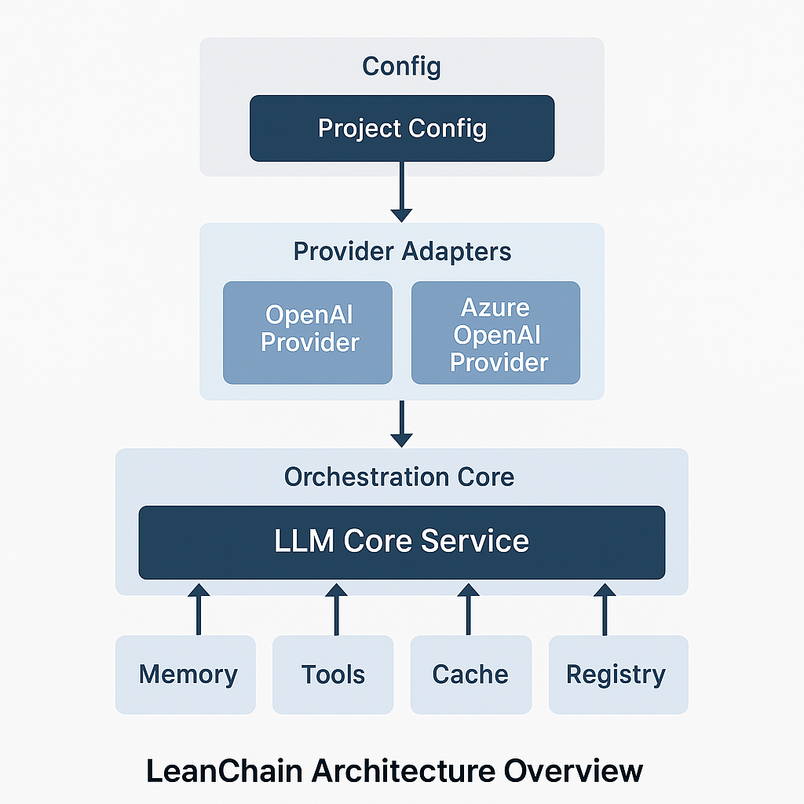

# LeanChain

LeanChain is a lightweight and modular LLM orchestration framework inspired by LangChain — but designed for clarity, runtime flexibility, and minimal overhead. It supports multiple LLM vendors, streaming, memory, tools, and caching with future extensibility to multimodal tasks.

---

## 🏗️ Architecture Overview

LeanChain is built on 3 core principles:

1. **Provider Abstraction**: Decouple your app from specific LLM vendors via standardized interfaces (OpenAI, Azure, etc.)
2. **Modular Composition**: Plug-and-play memory, tools, and cache
3. **Runtime Flexibility**: Switch vendors or models during runtime

---
### LLM Core Service Architecture Overview
<center>

</center>

### 📦 Modular Architecture

| Module       | Description                                                                      |
|--------------|----------------------------------------------------------------------------------|
| **Config**   | Defines how vendors are selected and credentials injected (via `BaseAIConfig`)   |
| **Provider** | Implements standardized classes (`OpenAIProvider`, `AzureOpenAIProvider`, etc.)  |
| **Registry** | Dynamic vendor/model resolver with `llm_registry` and `vendor_map`               |
| **Loader**   | Loads a single provider using project-level configuration                        |
| **Core**     | Main orchestrator `LLMCoreService`, handling chat flow, tools, memory, and cache |
| **Memory**   | Handles memory logic — `ShortMemoryBuffer`, `ExpiringMemoryWrapper`, etc.        |
| **Tools**    | Plugin tools like `MathTool`, allowing external logic injectioners               |
| **Utility**  | Lightweight helpers like simple file-based cache                                 |


### 🔄 How It Works

1. Load config and instantiate a provider via `load_single_provider()` or `llm_registry`.
2. Create `LLMCoreService` with optional memory, tools, and cache.
3. Use `chat()` or `stream_chat()` to interact with LLMs.
4. Inject or clear memory; plug in tools for external processing (e.g., math).
5. Switch vendor or model at runtime without changing core logic.

### ✅ Why LeanChain?

- ✅ Clean and understandable codebase (great for learning or teaching)
- ✅ Runtime flexibility without heavy dependencies
- ✅ Extendable for multimodal (image/audio) and agentic workflows

---


## ⚙️ Installation

Clone or unzip this repository and install with:

```bash
pip install -e .
```

Make sure to install OpenAI Python SDK (already in `setup.py`):

```bash
pip install openai
```

---

## 🧠 Usage Examples

### 1. Quick Chat Example

```python
from leanchain.registry.llm_registry import get_llm_service

llm = get_llm_service(vendor="openai", api_key="sk-...")
response = llm.chat("Tell me a joke.", model="gpt-4.1-nano")
print("🤖", response)

```

---
### 2. Configuration Example

```python
# config/ai_config.py
from leanchain.config.base_config import BaseAIConfig

class MyAIConfig(BaseAIConfig):
    @property
    def vendor(self): return "openai"
    @property
    def api_key(self): return "sk-..."
    @property
    def model(self): return "gpt-4.1-nano"
    @property
    def embedding_model(self): return "text-embedding-3-small"
    @property
    def embedding_vendor(self): return "openai"


```

---
### 3. Simple chat using project configuration

```python
from config.ai_config import MyAIConfig
from leanchain.core.llm_core import LLMCoreService
from leanchain.loaders.load_single_provider import load_single_provider

# Step 1: Load configuration
config = MyAIConfig()

# Step 2: Load OpenAI provider
provider = load_single_provider(config)

# Step 3: Set up the core chat service
llm = LLMCoreService(provider=provider)

# Simple message
response = llm.chat("What is the capital of France?")  # change model if applicable: model="gpt-4o-mini"
print("🤖", response)
```

---

### 4. Chat with Memory, Tools, and Cache

```python
from config.ai_config import MyAIConfig
from leanchain.core.llm_core import LLMCoreService
from leanchain.loaders.load_single_provider import load_single_provider
from leanchain.memory.short_memory import ShortMemoryBuffer
from leanchain.utils.cache import Cache
from leanchain.tools.tool import MathTool

# Step 1: Load config and provider
config = MyAIConfig()
provider = load_single_provider(config)

# Step 2: Setup memory, cache, and tool
memory = ShortMemoryBuffer(max_turns=3)
cache = Cache()
tools = [MathTool()]

# Step 3: Build core service with extended features
llm = LLMCoreService(
    provider=provider,
    memory=memory,
    cache=cache,
    tools=tools
)

# Step 4: Chat example (MathTool will handle this)
message = "What is 123 * 456?"
response = llm.chat(message)
print("🤖", response)

# Step 5: Ask a follow-up question to test memory
followup = "Can you remind me what we talked about?"
response2 = llm.chat(followup)
print("🤖", response2)

# Step 6: Clear the memory
memory.clear()
print("🧠 Memory cleared.")

# Step 7: Ask again to see if memory is gone
response3 = llm.chat("Can you remind me what we talked about?")
print("🤖", response3)

```

### 5. Simple Embedding

```python
from config.ai_config import MyAIConfig
from leanchain.loaders.load_single_provider import load_single_provider

# Step 1: Load config
config = MyAIConfig()

# Step 2: Load embedding-capable provider
provider = load_single_provider(config)

# Step 3: Embed text
text = "Artificial Intelligence will shape the future."
embedding = provider.embed(text)

# Step 4: Show result
print(f"🔢 Embedding Vector Length: {len(embedding)}")
print(f"📈 First 5 values: {embedding[:5]}")


```
---

## 🔁 Switching Vendors or Models at Runtime

LeanChain is designed for runtime flexibility — allowing your application to dynamically choose:

- ✅ Different **LLM vendors** (e.g., OpenAI, Azure)
- ✅ Different **models** per request (e.g., `gpt-4o-mini`, `gpt-4.1-nano`, etc.)

### 🎯 How It Works

- Use `llm_registry.get_llm_service(vendor, api_key)` to load a new provider at runtime.
- Specify the model when calling `.chat()` instead of hard-coding it in the config.

### 🧠 Example
```python
from config.ai_config import MyAIConfig
from leanchain.core.llm_core import LLMCoreService
from leanchain.loaders.load_single_provider import load_single_provider

# Updated imports reflecting renamed files
from leanchain.memory.short_memory import ShortMemoryBuffer
from leanchain.utils.cache import Cache
from leanchain.tools.tool import MathTool

# Step 1: Load config and provider
config = MyAIConfig()
provider = load_single_provider(config)

# Step 2: Setup memory, cache, and tool
memory = ShortMemoryBuffer(max_turns=3)
cache = Cache()
tools = [MathTool()]

# Step 3: Build core service with extended features
llm = LLMCoreService(
    provider=provider,
    memory=memory,
    cache=cache,
    tools=tools
)

# Step 4: Chat example (MathTool will handle this)
message = "What is 123 * 456?"
response = llm.chat(message)
print("🤖", response)

# Step 5: Ask a follow-up question to test memory
followup = "Can you remind me what we talked about?"
response2 = llm.chat(followup)
print("🤖", response2)

# Step 6: Clear the memory
memory.clear()
print("🧠 Memory cleared.")

# Step 7: Ask again to see if memory is gone
response3 = llm.chat("Can you remind me what we talked about?")
print("🤖", response3)

```

---

## 🔮 What’s Next

- 🧠 Agent-based tool chaining
- 🖼️ Multimodal support (image + audio)
- 🗂️ Custom workflows & pipelines

---

## 📄 License

MIT License – free to use, modify, and extend.

---

---
# Appendixes
## 📐 Appendix A: Key Components

| Component                  | Purpose                                             |
|----------------------------|-----------------------------------------------------|
| `llm_provider.py`          | Defines `ChatProvider`, `EmbeddingProvider`, etc.   |
| `openai_provider.py`       | Implements OpenAI via new `openai.OpenAI()` client  |
| `azure_openai_provider.py` | Adds support for Azure OpenAI SDK                   |
| `llm_core.py`              | Main wrapper that routes chat, tools, memory, cache |
| `llm_registry.py`          | Dynamic runtime LLM provider loader                 |
| `load_single_provider.py`  | Loads a single provider based on config/env         |
| `memory/`                  | Refer to *Appendix B*                               |
| `tool.py`                  | Defines external tools like `MathTool`              |
| `cache.py`                 | Simple file-based caching layer                     |

---

## 🧠 Appendix B: LeanChain Memory Features

LeanChain supports **pluggable memory modules** that persist and inject chat history across interactions. Memory enhances conversational continuity by allowing the AI to “remember” past messages.

### ✅ Core Features:
- **Injectable Memory**: Automatically prepends chat history to each new user message.
- **Modular Design**: Choose from different memory strategies (short-term, expiring, session-based).
- **Custom Clear**: Memory can be cleared manually or automatically based on TTL (Time-to-Live).

### 🧩 Available Memory Modules:
| Memory Type             | Description                                           |
|-------------------------|-------------------------------------------------------|
| `ShortMemoryBuffer`     | Stores the last *n* turns of conversation.            |
| `ExpiringMemoryWrapper` | Auto-clears memory after a set number of seconds.     |
| `SessionMemoryManager`  | Manages memory per session/user ID (optional).        |

### 🔧 Quick Example to clear memory manually
```python
# extract from examples/chat_with_memory_tool_cache.py

memory = ShortMemoryBuffer(max_turns=3)
llm = LLMCoreService(provider=provider, memory=memory)

llm.chat("Hello!")  # saved
memory.clear()  # clears history

```

### 🔧 Simple Example to Auto-clear Memory
```python
from config.ai_config import MyAIConfig
from leanchain.core.llm_core import LLMCoreService
from leanchain.loaders.load_single_provider import load_single_provider
from leanchain.memory.short_memory import ShortMemoryBuffer
from leanchain.memory.expiring_memory_wrapper import ExpiringMemoryWrapper
from leanchain.utils.cache import Cache
from leanchain.tools.tool import MathTool

import time

# Load config and provider
config = MyAIConfig()
provider = load_single_provider(config)

# Use short-term memory wrapped with expiration
short_memory = ShortMemoryBuffer(max_turns=3)
memory = ExpiringMemoryWrapper(short_memory, ttl_seconds=10)  # auto-clear after 10 seconds

cache = Cache()
tools = [MathTool()]

llm = LLMCoreService(
    provider=provider,
    memory=memory,
    cache=cache,
    tools=tools
)

print("Step 1: Initial message")
print("🤖", llm.chat("What is 11 * 11?"))

print("\nStep 2: Test memory immediately")
print("🤖", llm.chat("Can you remind me what we talked about?"))

print("\n💤 Waiting for 11 seconds to let memory expire...")
time.sleep(11)

print("\nStep 3: Test memory after expiration")
print("🤖", llm.chat("Can you remind me what we talked about?"))


```

---

# 🤝 Contributing
Coming soon! For now, please star ⭐ the project and submit issues or pull requests.

---
